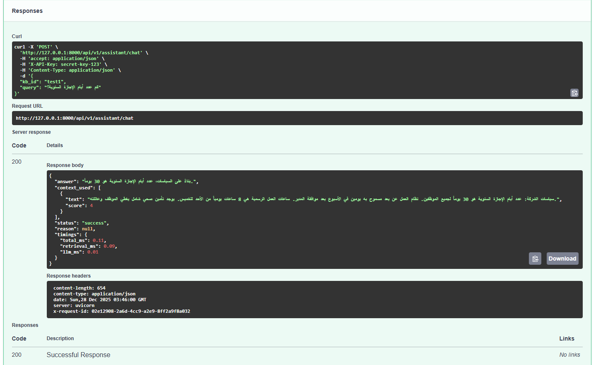

MRAG: Enterprise-Grade RAG Kernel & LLM Gateway

> **A robust, observable, and modular infrastructure for building Retriever-Augmented Generation (RAG) applications with built-in cost governance and security compliance.**

---

## Executive Summary

Moving Generative AI from "prototype" to "production" introduces complex challenges: hallucination risks, unpredictable costs, and lack of observability.

**MRAG (Mini Foundry RAG)** is a production-ready backend kernel designed to solve these challenges. It acts as a secure gateway between your enterprise data and Large Language Models (LLMs). Unlike monolithic frameworks, MRAG utilizes a **Clean Architecture** approach, ensuring separation of concerns between ingestion, retrieval, and generation.

It is engineered with **FinOps principles** at its core, providing granular token tracking and cost estimation for every request, and uses **Mock Services** during development to ensure zero-cost, high-stability CI/CD pipelines.

### Live System Demo
*The system handling a RAG query via Swagger UI, demonstrating context retrieval and latency tracking:*

---

## Technical Highlights

### Architecture & Design Patterns
*   **Layered Architecture:** Strict separation between `API`, `Core`, `Services`, and `Models`.
*   **Dependency Injection:** Services (like `LLMService` and `SearchService`) are instantiated as singletons and injected.
*   **Hybrid Service Strategy:**
    *   **Development:** Uses robust **Mock/In-Memory Adapters** (simulating LLM & Vector Store) to guarantee 100% test reliability and zero latency during local development.
    *   **Production:** Designed to hot-swap with **Azure AI Search** and **Google Gemini/OpenAI** via environment configuration.

### Security & Compliance
*   **Input Validation:** Rigorous schema enforcement using **Pydantic V2**.
*   **PII Sanitization:** Automatic redaction of emails and phone numbers during the document ingestion pipeline (`IngestionService`).
*   **Secret Management:** Adheres to 12-Factor App principles. Supports seamless switching between local `.env` files and **Azure Key Vault** in production.
*   **Rate Limiting:** IP and Key-based throttling (`slowapi`) to prevent DDoS and abuse.

### Observability & FinOps
*   **Tokenomics Engine:** A dedicated layer tracks `prompt_tokens` and `completion_tokens` per request.
*   **Custom Middleware:** `monitoring_middleware` captures precise latency metrics and injects `X-Request-ID` for distributed tracing.
*   **Health Telemetry:** The `/health` endpoint exposes live operational counters for Prometheus scraping.

---

## System Architecture

The data flow is designed to be synchronous yet non-blocking for I/O bound operations.

graph LR
    User[Client / UI] -->|HTTPS + API Key| Gateway[FastAPI Gateway];
    Gateway -->|Auth & Rate Limit| Middleware[Security Layer];
    Middleware -->|Query| Orch[RAG Orchestrator];
#    
#    subgraph "Ingestion Pipeline"
#        Doc[Document] -->|Sanitize PII| Cleaner[Ingestion Service];
#        Cleaner -->|Chunking| Chunker;
#        Chunker -->|Index| VectorDB[(Abstract Vector Store)];
#    end
#
#    subgraph "Retrieval & Gen"
#        Orch -->|Fetch Context| VectorDB;
#        VectorDB -->|Context Chunks| Orch;
#        Orch -->|Guardrail Check| Policy[Policy Engine];
#        Policy -->|Valid Context| LLM[LLM Service / Mock Adapter];
#        LLM -->|Generate + Token Usage| Orch;
#    end
#    
#    Orch -->|Response + Timings| User;
Quick Start (Developer Experience)

We prioritize a seamless DX. A Makefile is provided to abstract complex setup commands.

Prerequisites

Python 3.10+

Installation

Clone and Setup:

git clone https://github.com/Magood1/MRAG.git
cd MRAG
# Creates virtualenv and installs dependencies
make setup

Environment Configuration:

cp .env.sample .env
# Edit .env (Default is set for Development/Mock mode)

Run the Server:

make run
# Server starts at http://localhost:8000
Performance & Reliability

We maintain a strict evaluation pipeline to ensure the system answers correctly and rejects hallucinations.

Current Status: View Full Performance Report

Metric	Result	Target	Status
Success Rate	100.0%	> 90%	✅
Avg Latency	9 ms	< 200 ms	✅
P95 Latency	15 ms	< 500 ms	✅

Note: Latency is minimized due to the use of Mock Services in the Dev environment.

🔌 Usage & API Reference
1. RAG Query (Core)

Execute a grounded query against the knowledge base. Note the timings block for latency analysis.

Request:
curl -X POST http://localhost:8000/api/v1/assistant/chat \
  -H "X-API-Key: secret-key-123" \
  -H "Content-Type: application/json" \
  -d '{
    "kb_id": "test1",
    "query": "What is the annual vacation policy?"
  }'

Response:

code
JSON
download
content_copy
expand_less
{
  "answer": "Based on the policy, the annual vacation is 30 days.",
  "context_used": [
    {"text": "Annual vacation policy is 30 days...", "score": 3}
  ],
  "status": "success",
  "timings": {
    "total_ms": 15.2,
    "retrieval_ms": 2.1,
    "llm_ms": 10.5
  }
}
2. Health Check (Ops)

Used by load balancers (Azure App Service) to verify service availability.

curl -X GET http://localhost:8000/health
🧪 Development & Testing Protocol

We employ a strict testing strategy covering Unit, Integration, and Security layers.

Static Analysis: Enforced via Ruff and Black.

make lint

Unit Tests: Validates ingestion logic, PII redaction, and API endpoints.

make test

Security Audit: Scans code for vulnerabilities using Bandit.

make security-check
🗺️ Roadmap & Contribution

The architecture is designed for extensibility:

Core RAG Pipeline: Ingestion, Chunking, Retrieval, Generation.

Security Hardening: API Keys, PII Redaction, Blocklists.

Observability: Custom Middleware for Latency tracking.

Resilience: Mock Adapters for stable testing.

Vector DB Integration: Adapters for Qdrant & Azure AI Search.

Advanced Reranking: Integrating Cross-Encoders for higher retrieval precision.

Author: Magood1
Role: Backend & AI Engineer
